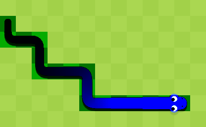

# Dessinons le serpent

## Comment est constitué le serpent ?

Dans le jeu du Snake, un serpent est simplement composé de plusieurs « blocs », comme on peut le voir ci-dessous :




Notre jeu doit donc déjà savoir où sont ces blocs : il nous faudra donc une liste pour stocker ces différentes positions 🗒️

## Créons la liste des segments du serpent

Créons donc une liste des segments appelée `snake_set` que l'on définira de la manière ci-dessous, de sorte à ce que la fonction `setup` ressemble à ceci :

```js
function setup() {
  createCanvas(400, 400);

  snake_set = [];
}
```

Cette liste contiendra des positions, qui sont en réalité elles-mêmes des listes de deux éléments $x$ et $y$.


Nous allons préremplir la liste `snake_set` de deux éléments qui vont contenir le tout début de notre serpent :


```js
// Juste après `snake_set = []`

snake_set.push([19, 19]);
snake_set.push([19, 20]);
```

Comme vous l'aurez compris, la fonction `push` associée à `snake_set` permet d'ajouter un élément spécifié à la liste.

Nous utiliserons le premier élément de la liste comme la **tête** du serpent.

### Pourquoi des coordonnées aussi petites ?

Vous l'aurez très certainement remarqué, mais entre $(19, 19)$ et $(19, 20)$, il n'y a qu'un seul pixel de différence.

Cependant, rien ne nous empêche de dire que ces coordonnées ne représentent pas forcément des pixels sur l'écran, mais plutôt des carrés sur l'écran.

Nous nous contenterons de dire qu'un carré est de taille **10 pixels par 10 pixels**, donc nous devrons dessiner des *rectangles* de 10 par 10 auxquels nous aurons **multiplié** leurs composantes $x$ et $y$ de coordonnées par 10 

En multipliant par 10, nous établissons que :

  - le carré en $(0, 0)$ se place réellement en $(0, 0)$
  - le carré en $(0, 1)$ se place réellement en $(0, 10)$
  - le carré en $(1, 0)$ se place réellement en $(10, 0)$
  - etc.

... ce qui fait que nous avons de gros « pixels », d'une certaine façon.

## Exercices 03 : dessinons notre liste

Afin d'afficher le serpent, nous devons donc maintenant **itérer** sur la liste `snake_set`.


Cela veut dire que nous souhaitons, pour chaque élément dans la liste, faire quelque chose avec. Fort heureusement pour nous, il existe une fonction pour ça \!

Voici un exemple pour que vous compreniez comment l'utiliser :

```js
snake_set.forEach((element) => {
  console.log(element);
});
```

Ce code ci-dessus va afficher chaque élément présent dans la liste `snake_set` sur la console de l'éditeur \! Cela est possible grâce au `.forEach(element)`, `element` représente une "case" de notre liste.

Si vous souhaitez accéder à un élément d'une liste, il suffit de faire ceci :

```js
element[0] // premier élément
element[1] // second élément
element[x] // x eme élément
```

En vous inspirant de l'exemple plus haut et de ce qui a déjà été fait, essayez de construire une boucle qui va afficher chaque carré à partir des coordonnées de la liste `snake_set`.

Note : N'hésitez surtout pas à changer la couleur des rectangles en consultant [la référence de p5.js](https://p5js.org/reference/), un jeu se doit d'être joli à regarder 

